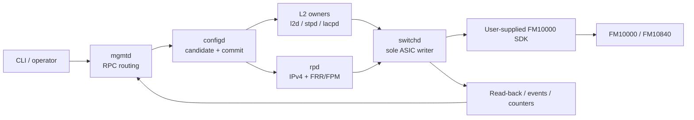

# NetLab OS

[](https://github.com/netlab-switch/netlab-os/actions/workflows/ci.yml)
[](LICENSE)
[](docs/hardware-sdk.md)

[English](README.md) | [简体中文](README.zh-CN.md)

NetLab OS is an experimental, real-hardware switch operating system for the
Intel FM10000/FM10840 family. It combines a transactional Junos-style CLI, a
YANG-backed configuration database, small single-purpose daemons, FRR route
integration, and a single hardware-programming authority in `switchd`.

This repository is a clean public source release. It contains no vendor SDK,
vendor SDK patches, firmware, runtime binaries, credentials, or private lab
inventory. Real-hardware builds require an SDK copy that you are independently
authorized to use.

> Project status: suitable for source study, control-plane development, and
> hardware experimentation. It is not a supported production network OS.

## Why NetLab OS?

- Transactional configuration: candidate/active state, `commit check`,
  rollback, confirmed commit, journaling, and restart replay.
- Explicit ownership: `configd` owns configuration transactions, feature
  daemons own intent, and only `switchd` writes the ASIC.
- Fail-closed hardware boundary: plans are validated before programming and
  paired with read-back, rollback, and reconciliation contracts.
- Real switching scope: VLAN, LAG/LACP, RSTP/MSTP, LLDP, IGMP snooping,
  ACL/QoS subsets, SPAN, IPv4 RIF/ARP/ECMP/FIB, and FRR/FPM integration.
- Honest capability states: stable, bounded, experimental, and closed features
  are documented separately instead of being advertised as one flat list.

## Architecture



See [Architecture](docs/architecture.md) for daemon ownership, commit flow,
rollback, replay, and operational-state design.

## Quick start

The default build intentionally excludes the proprietary SDK-backed `switchd`.
It builds the complete control plane.

Requirements: GCC, GNU Make, pkg-config, OpenSSL development headers, libyang
2.x development headers, and Python 3.11 or newer.

```bash
git clone https://github.com/netlab-switch/netlab-os.git
cd netlab-os

# Build the public control plane
make

# Create a pinned Python environment and run 21 SDK-free public tests
make cli
make check PYTHON=.venv/bin/python
```

If libyang 2.x is installed in a custom prefix:

```bash
make NETLAB_LIBYANG_PREFIX=/opt/libyang2
make check PYTHON=.venv/bin/python NETLAB_LIBYANG_PREFIX=/opt/libyang2
```

## CLI taste

```text
user@netlab> show interfaces terse
user@netlab> show ethernet-switching table
user@netlab> show spanning-tree bridge
user@netlab> show route summary

user@netlab> configure
[edit]
user@netlab# set vlans blue vlan-id 100
user@netlab# set interfaces et-0/0/0 unit 0 family ethernet-switching interface-mode trunk
user@netlab# set interfaces et-0/0/0 unit 0 family ethernet-switching vlan members blue
user@netlab# show | compare
user@netlab# commit check
user@netlab# commit confirmed 5 comment "safe remote change"
```

The transcript shows syntax, not bundled simulated hardware output. See the
[CLI demo](docs/cli-demo.md) for complete L2, IPv4, rollback, and verification
workflows.

## Capability snapshot

| Area | Public status | Highlights |
| --- | --- | --- |
| Configuration | Stable | YANG candidate/active model, commit check, confirmed commit, rollback, replay |
| L2 switching | Stable | VLAN, access/trunk/native VLAN, FDB, LAG/LACP, LLDP, RSTP/MSTP |
| L2 security | Bounded | Storm control, rate limit, secure access port, DHCP snooping, ARP inspection |
| ACL | Bounded | Scoped Ethernet/IPv4 ingress, egress MAC filtering, counters, narrow policer |
| QoS | Bounded | Priority mapping, PFC configuration, scheduler groups, shaping, selected watermarks |
| IPv4 L3 | Bounded | RIF, static ARP/routes, ECMP, FIB ownership, one static-only VRF |
| Dynamic routing | Experimental | FRR/FPM integration and OSPF/BGP route plumbing; production qualification is incomplete |
| Observability | Bounded | Interfaces, FDB, routes, ASIC resources, events, counters, chassis and queue views |
| SPAN / sFlow | Partial | One local SPAN session; sFlow sampler/capture exists without public exporter service |
| IPv6/VXLAN/EVPN/NAT/MLAG | Closed | Outside the current single-card IPv4 leaf scope |

The detailed evidence-oriented matrix is in [Implemented features](docs/features.md).

## Hardware and SDK boundary

The public repository includes the `switchd` integration source but not the
FM10000 SDK. To compile it, provide an authorized SDK tree:

```bash
make hardware NETLAB_SDK_DIR=/path/to/authorized-sdk/ies
```

The maintained Linux driver is a separate public project:
[netlab-fm10k-driver](https://github.com/netlab-switch/netlab-fm10k-driver).
No driver patch is duplicated here.

Read [Hardware and SDK](docs/hardware-sdk.md) before attempting a hardware
build. The public tree does not contain the private production deployment,
SDK-hardening, or laboratory release workflow.

## Repository map

- `bin/cli/` — interactive CLI, completion, configuration path mapping, output.
- `include/netlab/` — YANG model and shared typed contracts.
- `lib/` — IPC, configuration, daemon, event bus, logging, and L3 ownership.
- `sbin/` — management, L2/L3, protocol, telemetry, and hardware daemons.
- `tools/` — narrow internal RPC and process-boundary helpers.
- `config/platform/` — public FM10840 platform profile examples.
- `tests/integration/` — control-plane contracts plus optional hardware tests;
  the public CI manifest selects 21 self-contained, SDK-free tests.
- `docs/` — architecture, features, CLI demo, development, and hardware boundary.

## Contributing and security

Start with [CONTRIBUTING.md](CONTRIBUTING.md). Please report security issues
using the private channel described in [SECURITY.md](SECURITY.md), not a public
issue. By participating, you agree to the [Code of Conduct](CODE_OF_CONDUCT.md).

NetLab OS is licensed under Apache License 2.0. Intel and FM10000 are trademarks
of their respective owners; this project is independent and is not affiliated
with or endorsed by Intel.
