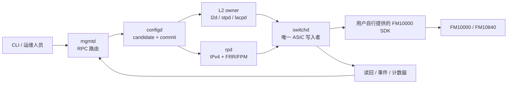

# NetLab OS

[](https://github.com/netlab-switch/netlab-os/actions/workflows/ci.yml)
[](LICENSE)
[](docs/hardware-sdk.md)

[English](README.md) | [简体中文](README.zh-CN.md)

NetLab OS 是面向 Intel FM10000/FM10840 系列芯片的实验性、真实硬件交换机
操作系统。项目把类 Junos 事务式 CLI、YANG 配置数据库、单一职责 daemon、
FRR 路由集成，以及由 `switchd` 独占的硬件写入边界组合在一起。

这是经过清洗的全新公共源码仓库，不包含厂商 SDK、SDK 补丁、固件、运行时
二进制、凭据或私有实验室拓扑。真实硬件构建需要使用者自行取得合法授权的 SDK。

> 当前定位：适合源码研究、控制面开发和硬件实验；它不是带商业支持的生产网络
> 操作系统。

## 为什么做 NetLab OS

- 事务式配置：candidate/active、`commit check`、回滚、confirmed commit、
  journal 和重启 replay。
- 明确的数据权威：`configd` 管理配置事务，各 feature daemon 管理意图，只有
  `switchd` 可以写 ASIC。
- Fail-closed 硬件边界：配置 plan 在写入前验证，并具有读回、回滚和重启收敛合同。
- 面向真实交换功能：VLAN、LAG/LACP、RSTP/MSTP、LLDP、IGMP snooping、
  ACL/QoS 子集、SPAN、IPv4 RIF/ARP/ECMP/FIB 和 FRR/FPM。
- 不夸大能力：稳定、有限开放、实验性和关闭能力分别列出。

## 架构



完整的 daemon 所有权、commit、rollback、replay 和 operational state 设计见
[架构设计](docs/architecture.md)。

## 快速开始

默认构建不会编译依赖专有 SDK 的 `switchd`，只构建完整公共控制面。

依赖：GCC、GNU Make、pkg-config、OpenSSL 开发包、libyang 2.x 开发包，以及
Python 3.11 或更高版本。

```bash
git clone https://github.com/netlab-switch/netlab-os.git
cd netlab-os

# 构建公共控制面
make

# 创建锁定依赖的 Python 环境并运行 21 项无 SDK 公共测试
make cli
make check PYTHON=.venv/bin/python
```

如果 libyang 2.x 安装在自定义目录：

```bash
make NETLAB_LIBYANG_PREFIX=/opt/libyang2
make check PYTHON=.venv/bin/python NETLAB_LIBYANG_PREFIX=/opt/libyang2
```

## CLI 示例

```text
user@netlab> show interfaces terse
user@netlab> show ethernet-switching table
user@netlab> show spanning-tree bridge
user@netlab> show route summary

user@netlab> configure
[edit]
user@netlab# set vlans blue vlan-id 100
user@netlab# set interfaces et-0/0/0 unit 0 family ethernet-switching interface-mode trunk
user@netlab# set interfaces et-0/0/0 unit 0 family ethernet-switching vlan members blue
user@netlab# show | compare
user@netlab# commit check
user@netlab# commit confirmed 5 comment "safe remote change"
```

以上内容展示真实语法，不伪造硬件输出。完整 L2、IPv4、回滚和验证流程见
[CLI Demo](docs/cli-demo.md)。

## 功能概览

| 领域 | 公开状态 | 主要能力 |
| --- | --- | --- |
| 配置系统 | 稳定 | YANG candidate/active、commit check、confirmed commit、rollback、replay |
| L2 交换 | 稳定 | VLAN、access/trunk/native VLAN、FDB、LAG/LACP、LLDP、RSTP/MSTP |
| L2 安全 | 有限开放 | 风暴控制、速率限制、安全接入口、DHCP snooping、ARP inspection |
| ACL | 有限开放 | Ethernet/IPv4 ingress、egress MAC 过滤、计数器、有限 policer |
| QoS | 有限开放 | 优先级映射、PFC 配置、调度组、整形、部分 watermark |
| IPv4 L3 | 有限开放 | RIF、静态 ARP/路由、ECMP、FIB owner、一个静态 VRF |
| 动态路由 | 实验性 | FRR/FPM 及 OSPF/BGP 路由链路，尚未完成生产资格验证 |
| 可观测性 | 有限开放 | 接口、FDB、路由、ASIC 资源、事件、计数器、机箱和队列视图 |
| SPAN / sFlow | 部分实现 | 一个本地 SPAN；sFlow 已有 sampler/capture，但没有公开 exporter 服务 |
| IPv6/VXLAN/EVPN/NAT/MLAG | 关闭 | 不属于当前单卡 IPv4 leaf 范围 |

详细矩阵见[已实现功能](docs/features.md)。

## 硬件与 SDK 边界

公共仓库包含 `switchd` 对接源码，但不提供 FM10000 SDK。使用已获授权的 SDK
进行编译：

```bash
make hardware NETLAB_SDK_DIR=/path/to/authorized-sdk/ies
```

Linux 驱动由独立公开仓库维护：
[netlab-fm10k-driver](https://github.com/netlab-switch/netlab-fm10k-driver)。
本仓库不再复制任何驱动 patch。

尝试硬件构建前请阅读[硬件与 SDK](docs/hardware-sdk.md)。公共仓库不包含私有
生产部署、SDK hardening 或实验室 release 工作流。

## 目录

- `bin/cli/`：交互式 CLI、补全、配置路径和输出格式化。
- `include/netlab/`：YANG 模型和共享 typed contract。
- `lib/`：IPC、配置、daemon、event bus、日志和 L3 ownership。
- `sbin/`：管理面、L2/L3、协议、遥测和硬件 daemon。
- `tools/`：内部 RPC 与进程边界小工具。
- `config/platform/`：公开 FM10840 platform profile 示例。
- `tests/integration/`：控制面 contract 与可选硬件测试；公共 CI 只选择 21 项
  自包含、无 SDK 测试。
- `docs/`：架构、功能、CLI demo、开发和硬件边界。

参与开发请阅读 [CONTRIBUTING.md](CONTRIBUTING.md)。安全问题请按
[SECURITY.md](SECURITY.md) 私下报告，不要提交公开 issue。

NetLab OS 使用 Apache License 2.0。Intel 和 FM10000 是各自权利人的商标；
本项目独立开发，与 Intel 不存在隶属或背书关系。
