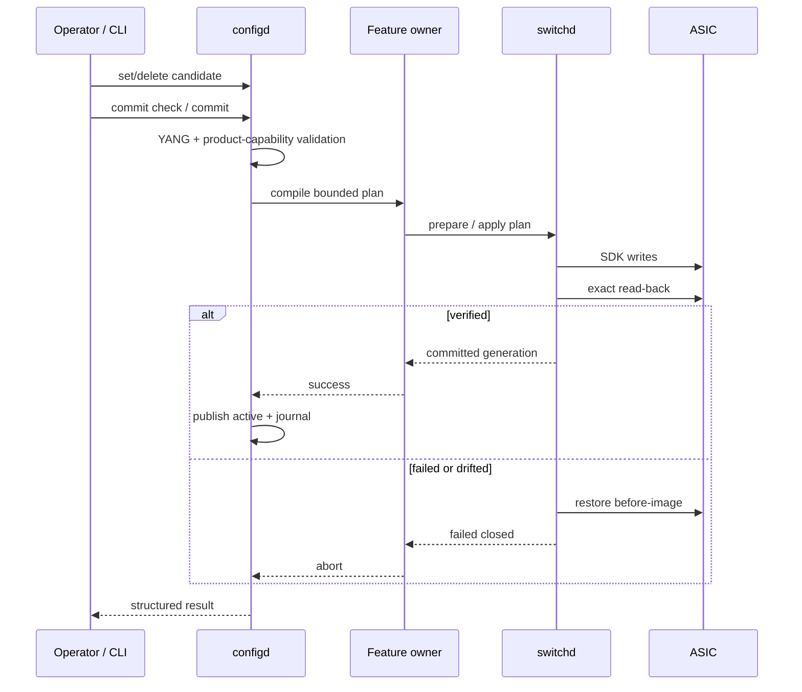

# Architecture / 架构设计

## Design goals / 设计目标

NetLab OS is built around four rules:

1. configuration is a transaction, not a sequence of best-effort writes;
2. every feature has one intent owner;
3. only `switchd` may program the ASIC;
4. success requires read-back, and failure requires rollback or fail-closed.

NetLab OS 围绕四条规则设计：配置必须是事务；每个功能只有一个意图 owner；
只有 `switchd` 能写 ASIC；成功必须有读回，失败必须回滚或 fail-closed。

## Process ownership / 进程所有权

| Component | Authority / 权威职责 |
| --- | --- |
| `mgmtd` | Routes typed RPC requests and separates view/control work. / 路由 typed RPC，并隔离只读与控制请求。 |
| `configd` | Owns candidate/active configuration, validation, commit journal, rollback and replay. / 管理 candidate/active、验证、journal、回滚和 replay。 |
| `ifd`, `l2d` | Compile interface and L2 intent into bounded plans. / 把接口和 L2 意图编译成有容量边界的 plan。 |
| `stpd`, `lacpd`, `lldpd` | Own protocol state and publish hardware intent/state. / 管理协议状态并发布硬件意图与状态。 |
| `rpd` | Owns IPv4 RIB, FRR/FPM integration, FIB generations and reconciliation. / 管理 IPv4 RIB、FRR/FPM、FIB generation 与收敛。 |
| `switchd` | Sole SDK/ASIC writer; applies plans, verifies read-back, emits counters/events. / 唯一 SDK/ASIC 写入者，执行 plan、读回并发布状态。 |

## Commit path / Commit 链路

The owner boundary prevents CLI parsing, configuration storage, protocol state,
and hardware programming from becoming competing sources of truth.

这个边界避免 CLI parser、配置数据库、协议状态和硬件状态同时成为互相冲突的
“真相来源”。

## IPC and operational state / IPC 与运行状态

Daemons communicate through bounded Unix `SOCK_SEQPACKET` contracts. Large
tables use typed snapshots or staged plans rather than assuming one response is
a complete state image. Operational CLI output is assembled from daemon-owned
state and hardware read-back; documentation is never treated as runtime proof.

Daemon 使用有界 Unix `SOCK_SEQPACKET` 合同通信。大型表使用 typed snapshot
或 staged plan，不能把一次部分响应当作完整状态。Operational CLI 从 daemon
状态和硬件读回生成，文档本身不作为运行证明。

## L3 path / L3 路径

FRR remains the routing-protocol engine. `rpd` owns the product contract around
it: configuration, protocol lifecycle, RIB selection, FPM decode, FIB
generation, replay and reconciliation. `switchd` receives only bounded FIB
intent and remains the sole SDK writer.

FRR 作为路由协议引擎；`rpd` 管理配置、协议生命周期、RIB 选择、FPM 解码、
FIB generation、replay 和收敛。`switchd` 只接收有界 FIB 意图。

## Public/private boundary / 公共和私有边界

The repository publishes source contracts and developer tests. It deliberately
does not publish:

- the proprietary FM10000 SDK or modifications to it;
- firmware or binary runtime bundles;
- production release activation and recovery evidence;
- credentials, live topology or equipment identifiers.

公共仓库只发布源码合同和开发测试，不发布专有 SDK/修改、固件、二进制 runtime、
生产 release 证据、凭据或真实实验室拓扑。
